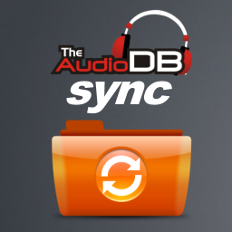

TheAudioDBSync addon allows you to retrieve Album and track ratings from [theaudiodb.com](http://www.theaudiodb.com) and update your Kodi Library with the new values.

For more information you can have a look at the wiki entry:

[Add-on:TheAudioDBSync](https://github.com/robwebset/script.theaudiodb.sync/wiki)

You can install this addon from: [Repository:URepo](http://www.urepo.org/)

To ask questions or comment about Suitability, please use the forum at [URepo.org](http://www.urepo.org/forum/viewtopic.php?t=1772)

__Donations__

If you have found TheAudioDBSync useful and would like to help support future development and bug fixes, then please feel free to make a small donation.

